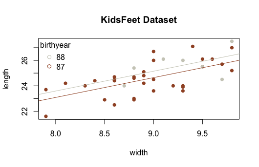

```{r, include=FALSE}
library(mosaic)
library(DT)
library(pander)
library(car)
library(tidyverse)
```

## General Concepts

In general, you should be able to:

* Identify the appropriate test that should be used for a given scenario. 
* Perform the appropriate test and create supporting graphics and numerical summaries in R.
* Recognize the four basic parametric distributions (normal, t, chi-squared, F) along with their parameters.
* Recognize the logic behind each nonparametric test.
* State the definition of a p-value.
* Identify the two things needed to obtain a p-value.
* Recognize when it is appropriate to make inference and when it is appropriate to just describe data.

## Weeks 1 & 2: R Intro & Descriptive Statistics {.tabset .tabset-fade}

### Overview

You should be able to:

*	State the various types, proper usages, and proper interpretations of numerical and graphical summaries.
*	Use R to compute numerical and graphical summaries for a given dataset.
*	Perform basic data manipulations in R with `subset()`, `[ , ]`, and `$`.

### Describing Data with R

#### Question 1

Use the Utilities dataset in RStudio, which records monthly utility costs and details for a certain residence, to create an appropriate graphic of monthly gas bill costs.

Be sure library(mosaic) is loaded.

Also, these commands may be useful.

```{r, eval=FALSE}
?Utilities
View(Utilities)
```

Based on what you find in your graphic, which statistic would be most meaningful for describing the typical cost of the monthly gas bill for this residence?

The three main choices of graphic for this question would be:

```{r}
stripchart(Utilities$totalbill, method="stack")
boxplot(Utilities$totalbill)
hist(Utilities$totalbill)
```

If you run these codes, you should decide to either use the boxplot or the histogram because of the large sample size. The dot plot (stripchart) is simply not useful in this case because it is too messy. However, in either the boxplot or histogram, you should note a right skewed distribution. When data is skewed, the median is the best measure of "typical" values. Thus, the answer to this question would be median. See "Median" in your Numerical Summaries page of your Math 325 Notebook for further details.

#### Question 2 

Use the Orange dataset in RStudio to compute the average circumference of orange trees that are 1,004 days old.

```{r}
mean(circumference ~ age, data=Orange)
```

#### Question 3 

Use the Orange dataset in RStudio to create an appropriate graphic that shows the growth in circumference of orange trees as they age. For which of the following ages of a tree would a circumference of 100mm be most unlikely to occur?

A good choice of graphic when there are two quantitative variables like "circumference" and "age" is a scatterplot. Placing "circumference" as the y-variable and "age" as the x-variable would allow us to clearly see the growth in "circumference" as the trees "age".

```{r}
plot(circumference ~ age, data=Orange)
abline(h=100, lty=2)
```

The addition of the horizontal line at a y-value of 100 using "abline(...)" is a bonus piece of code that makes for easy reference on the graphic.

From the ages given in the possible answers, 484 days is the one that is least likely to have a circumference of 100mm because the dots for that age (the ones on the far left of the graph) are incredibly far away from 100mm.

<br /> <br /> <hr />

### Intro to Data Wrangling & Visualization

#### Question 1

Use the mtcars dataset in R to compute the mean "Gross horsepower" of both automatic and manual transmission 1974 Motor Trend vehicles.

Run this code to get the answer:

```{r}
mtcars %>%
    group_by(am) %>%
    summarise(mean(hp)) %>%
    pander()
```

#### Question 2 

Use the mtcars dataset in R to make a graph that allows you to see how the quarter mile time (qsec) of 1974 Motor Trend vehicles is effected by the number of carburetors (carb) in the vehicle.

Select the statement below that correctly describes this relationship. --- On average, the more carburetors a vehicle has, the faster its quarter mile time. 

Since both qsec and carb are quantitative, a scatterplot is the best graphic.

```{r}
plot(qsec ~ carb, data=mtcars)
```

This helps show that the average qsec time (remember, average is the middle of the dots) drops (or gets faster) as the number of carburetors increases.

#### Question 3

Run the following codes in R. Then select the statement that most appropriately interprets the resulting graph.

```{r}
palette(c("skyblue","firebrick"))

plot(mpg ~ qsec, data=mtcars, col=as.factor(am), pch=16, xlab="Quarter Mile Time (seconds)", ylab="Miles per Gallon", main="1974 Motor Trend Vehicles")
legend("topright", pch=16, legend=c("automatic","manual"), title="Transmission", bty='n', col=palette())
```

The graph shows that both vehicles with automatic and manual transmissions get better gas mileage the faster their quarter mile time.

The graph produced by the code given shows gas mileage on the y-axis and quarter mile times on the x-axis. Also, as indicated by the legend, the color of the points is determined by whether the vehicle is automatic or manual transmission.

Since both transmission types show positive moderate correlations, we can conclude that higher quarter mile times (which means slower vehicles) correlate with higher gas mileages.

<br /> <br /> <hr />

## Weeks 3 & 4: t-Tests & Wilcoxon Tests {.tabset .tabset-fade}

### Overview

You should be able to:

*	Classify a scenario as an Independent or Paired Test.
* Classify a scenario as a t Test or Wilcoxon Test.
* Identify a t Test as a parametric test (t distribution) and the Wilcoxon Test as nonparametric.
* State the hypotheses for a t Test or Wilcoxon Test.
*	Correctly use `t.test()` or `wilcoxon.test()` in R.
* Check requirements.
* Interpret the results.

### T-Test

#### Question 1

Ensure you have library(mosaic) loaded in RStudio and can View(Births78). This dataset records data for every day of the year. In other words, each row of this dataset repesents a day of the year.

In a typical year, there are 52 weeks. However, 52 x 7 = 364, and as most of us know, there are 365 days in a year. This means that every year, at least one day gets to happen more than 52 times.

Use appropriate R commands and the Births78 dataset to determine which day of the week in 1978 occurred 53 times.

```{r}
Births78 %>%
  group_by(wday) %>%
  summarise(n()) %>%
  pander()
```

#### Question 2

Let μ represent the average number of births that a occur on a given day of the week, like Wendesday or Thursday.

Use the Births78 dataset in RStudio to test the following hypotheses.

$$
  H_0: \mu_\text{Wednesday} - \mu_\text{Thursday} = 0
$$

$$
  H_a: \mu_\text{Wednesday} - \mu_\text{Thursday} \neq 0
$$

Select the p-value of the test from the options below.

```{r}
BirthsWedThu <- dplyr::filter(Births78, wday %in% c("Wed","Thu"))

t.test(births ~ wday, data=BirthsWedThu, mu=0, alternative="two.sided", conf.level=0.95)
```

#### Question 3

What two things are required to compute a p-value?

A test statistic and a sampling distribution of the test statistic. 

<br /> <br /> <hr />

### Wilcoxon Test

#### Question 1

This question needs library(car).

Use the Salaries dataset in R to find the number of male and female assistant professors in the dataset.

Run the following code to get the answer:

```{r, eval=FALSE}
library(car)

View(Salaries)
?Salaries
```


```{r}
Salaries %>% 
  group_by(rank, sex) %>% 
  summarise(n()) %>%
  pander()
```

#### Question 2

Create an appropriate graphic using the Salaries dataset in R that would allow you to compare the distribution of salaries for faculty in discipline A ("theoretical") and discipline B ("applied") departments.

Run the following code to get the answer:

```{r}
boxplot(salary ~ discipline, data=Salaries)
```

Or, to be more complete:

```{r}
boxplot(salary ~ discipline, data=Salaries, xlab="Discipline", ylab="Salaries", main="Faculty from U.S. Colleges")
```

#### Question 3

Perform an appropriate Wilcoxon Test of the following hypotheses using the Salaries dataset in R.

H0:median discipline A salaries−median discipline B salaries=0
Ha:median difference of salaries≠0

Select the response below showing the correct test statistic, p-value, and conclusion of the test based on a significance level of 0.05.

```{r}
wilcox.test(salary ~ discipline, data=Salaries) %>% pander()
```

<br /> <br /> <hr />

## Weeks 5 & 6: ANOVA & Kruskal-Wallis {.tabset .tabset-fade}

### Overview

You should be able to:

* Classify a scenario as an ANOVA or Kruskal-Wallis Test.
* Recognize that the Kruskal-Wallis test is a nonparametric test.
* Identify an ANOVA as a parametric test (F distribution) and the Kruskal-Wallis Test as nonparametric.
* Know the difference between "Within Groups" and "Between Groups" variances for ANOVA.
* State the hypotheses for an ANOVA or Kruskal-Wallis Test.
*	Correctly use `aov()`, `summary()`, `plot(..., which=1:2)`, and `kruskal.test()` in R.
* Check requirements (constant variance and normal errors for ANOVA; not too many ties present for Kruskal-Wallis).
* Interpret the results.

### ANOVA Test

#### Question 1 

In a certain student's ANOVA analysis the "Between groups variance" was 18.52 while the "Within groups variance" was 4.9. What was the value of the test statistic of their ANOVA test?

As shown in the Explanation tab of the ANOVA page of the Math 325 Notebook, the ANOVA test statistic is an F statistic. It is calculated by taking the "Between groups variance" and dividing this by the "Within groups variance". Thus 18.52/4.9 = 3.779592 which rounds to 3.78.

#### Question 2

These were made using the length, domhand, and sex columns of the KidsFeet dataset.

Perform an ANOVA that would test the signfiicance of the patterns of the means that are shown in these three graphs. Based on your p-values and these graphs, which of the following is a correct conclusion to reach?

Among fourth graders, right handed boys have longer feet on average than left handed boys while the opposite is true for girls.

#### Question 3 

n the KidsFeet dataset, what is the average length of feet for fourth grade boys that are left handed? --- 24.1 cm 

<br /> <br /> <hr />

### Kruskal-Wallis Test

#### Question 1 

Use the Salaries dataset in R, library(car), to test the hypotheses

$$
  H_0: \text{The distribution of salary is the same for Associate, Assistant, and Full Professors.}
$$

$$
  H_a: \text{The distribution of salary differs for at least one type of Professor.} 
$$

Report the test statistic and conclusion of your test.

Test is performed with: 

```{r}
kruskal.test(salary ~ rank, data=Salaries)
```

Conclusions are obtained from: 

```{r}
boxplot(salary ~ rank, data=Salaries)
```

which shows Full Professors have the highest distribution, Associate Professors the next highest, and Assistant Professors have the lowest distribution.

#### Question 2

A waiter at a local restaurant collects data on how much they earn in tips (per person) when groups of people each pay separately for their meal versus when one member of the group pays for everyone. Their very small sample of data is as follows.

```{r message=FALSE, warning=FALSE, echo=FALSE}
pander(read_csv("./Data/kruskalwallisassess.csv"))
```

Which hypothesis test would be most appropriate for deciding if the average per person tip amount is higher when people that eat in groups each pay individually for their meal?

While techincally you could use a Kruskal-Wallis Test, when there are only two groups in the data, it is equivalent to performing a Wilcoxon Rank Sum Test. So the best decision would be to use the Wilcoxon Rank Sum Test. An Independent Samples t Test might also be useful if the data can be assumed to be normal. However, given the small sample size and the fact that there are no repeated values, the Wilcoxon Test is the safer option.

#### Question 3 

Which of the following correctly describes the test statistic, H, of the Kruskal-Wallis Test?

See "Step 5" of the Explanation file of the Kruskal-Wallis Test for details about the Kruskal-Wallis H Statistic.

ANOVA uses the F = (Between groups variance)/(Within groups variance) test statistic.

The One Sample t Test measures how far the sample mean is from mu for its test statistic.

The Wilcoxon Rank Sum test sums the ranks from one of the groups for its test statistic.

<br /> <br /> <hr />

## Weeks 7 & 8: Linear Regression {.tabset .tabset-fade}

### Overview

You should be able to:

* Identify a scenario as a linear regression.
* Recognize the explanatory and response variables of the regression.
* State both the t Test hypotheses and F Test hypotheses and recognize when to use either.
*	Correctly use `lm()`, `summary()`, and `plot(..., which=1:2)` in R.
* Check requirements (linearity, constant variance, normal errors, fixed x-values, and independent errors).
* Interpret the slope(s) and intercept of the regression.
* Make predictions using the regression model.

### Simple Linear Regression

#### Question 1

Use the KidsFeet dataset from library(mosaic) to perform a regression of the length of a child's foot (Y) on the width of a child's foot (X).

What is the estimated slope and intercept of the least squares regression line for this data?

```{r}
kids.lm <- lm(length ~ width, data=KidsFeet)
summary(kids.lm)
```

#### Question 2

Continue using the KidsFeet regression that you performed in the last problem. In other words, the regression of the length of a child's foot (Y) on the width of the child's foot (X).

Plot the regression in R. Then select the plot below that correctly depicts the scatterplot and regression line of this regression.

Run this code to get the answer:

```{r}
kids.lm <- lm(length ~ width, data=KidsFeet)
plot(length ~ width, data=KidsFeet)
abline(kids.lm)
```

#### Question 3

The residual plot from the regression of the length of a child's foot on the width of the child's foot (using the KidsFeet dataset from library(mosaic)) shows the following residual plots.

Select the statement that most correctly interprets these plots.

The "Residuals vs Fitted" plot shows the data to be linear and to have constant variance. However, the "Normal Q-Q" plot shows some evidence of non-normality of the residuals.

See the "Explanation" tab for Linear Regression under the section "Checking the Assumptions".

Click on the links for "Explanation" of both the "Residuals versus Fitted-values Plot" and the "Q-Q Plot of the Residuals".

<br /> <br /> <hr />

### Multiple Linear Regression

#### Question 1 

Use the Orange dataset in R to perform a linear regression of the circumference (y) of an orange tree according to the age of the tree (x).

Which regression assumption is not satisfied for this regression?

Run the following code to get the answer:

```{r}
plot(circumference ~ age, data=Orange) #notice the fanning out of the points on the right

orange.lm <- lm(circumference ~ age, data=Orange)

plot(orange.lm, which=1) #looks very linear, but variance is increasing (so not constant)

plot(orange.lm, which=2) #looks very normal.
```

#### Question 2 

The following regression was performed in R. The lm( ) output from the regression is shown below.

What is the y-intercept and slope of the line for Tree #2 shown in the plot below?


Y-intercept = 19.9609       Slope = 0.1250618 

#### Question 3

Suppose the regression model

$$
 Y_i = \beta_0 + \beta_1 X_{1i} + \beta_2 X_{2i} + \epsilon_i 
$$
is used to model the KidsFeet dataset in R using this code, which you should run in R:

```{r}
kids.lm <- lm(length ~ width + as.factor(birthyear), data=KidsFeet)
pander(summary(kids.lm))
```

Note that a plot of this regression is shown for your reference.



Which of the following correctly interprets the results of this regression?

Because the p-value for the β2 term is not significant, the two lines should really just be one line.

## Week 9: Project 1 & Practice Final

## Weeks 10 & 11: Logistic Regression {.tabset .tabset-fade}

### Overview

You should be able to:

* Identify a scenario as a logistic regression.
* Recognize the explanatory variables and binomial response variable of the regression.
* State the Z Test hypotheses for any single coefficient in the regression.
*	Correctly use `glm()`, `summary()`, and `curve()` in R.
* Check the goodness-of-fit of the logistic regression using an appropriate goodness-of-fit test (deviance residuals vs Hosmer-Lemeshow tests).
* Interpret the effect of a slope term on the odds ratio.
* Explain the difference between an odds and a probability.
* Make predictions of probabilities using the logistic model.

## Week 12: Chi Squared Tests of Independence {.tabset .tabset-fade}

### Overview

You should be able to:

* Identify a scenario as appropriate for a Chi squared Test.
* Explain what an expected count is and how it is calculated.
* State the hypotheses.
*	Correctly use `chisq.test()`, `test.object$residuals`, and `barplot()` in R.
* Check the requirements using the expected counts.
* Interpret the results using Pearson Residuals when the p-value is significant.


## Week 13: Permutation Tests {.tabset .tabset-fade}

### Overview

You should be able to:

*	State the logic behind the permutation test used to perform the Nonparametric Chi-squared Test.
* Perform a permutation test in R for any of the scenarios including: Independent Samples, Paired Samples, Regression, or Chi-squared. 
* Recognize that the only difference between a permutation test and the other tests taught in this course is in how the p-value is calculated. Everything else is the same.

## Week 14: Review & Final Exam
